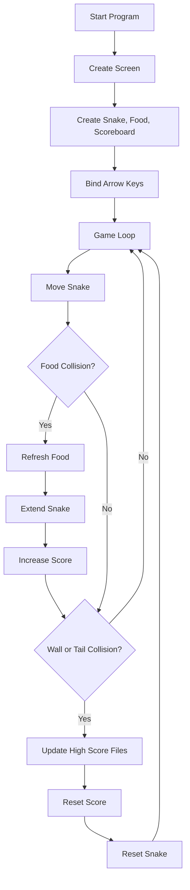

# Snake Game with High Score Tracking

A classic Snake game built with Python `turtle`.  
The game stores the highest score in `data.txt` and appends score history entries to `record.txt`.

## Features

- Real-time snake movement using arrow keys
- Food spawning at random coordinates
- Collision detection for:
  - walls
  - snake tail
- Automatic snake reset after collision (instead of closing game)
- Persistent high score saved across runs
- Score history logging in a separate record file

## Technical Details

- **Language:** Python
- **Graphics Library:** `turtle` (standard library)
- **Core Modules:**
  - `main.py` -> game loop, event binding, collision checks
  - `snake.py` -> snake body creation, movement, direction control, reset
  - `food.py` -> food object and random repositioning
  - `scoreboard.py` -> score rendering, high-score persistence, history logging
- **Data Files:**
  - `data.txt` -> stores the current high score
  - `record.txt` -> appends each newly achieved high score

## Game Flow Chart



## Python Version

- Recommended: **Python 3.9+**
- Works best with official Python installer from [python.org](https://www.python.org/downloads/) to ensure `tkinter`/`turtle` GUI support.

## How to Run

### 1) Clone the repository

```bash
git clone https://github.com/sunilsuman81/Snake-Game-high-score.git
cd Snake-Game-high-score
```

### 2) Run the game

```bash
python3 main.py
```

If `python3` is not available on your system:

```bash
python main.py
```

## Controls

- `Up Arrow` -> move up
- `Down Arrow` -> move down
- `Left Arrow` -> move left
- `Right Arrow` -> move right

## Scoring and Persistence

- Current score increases when snake eats food.
- On collision with wall or tail:
  - game score resets to `0`
  - if current score is greater than saved high score:
    - `data.txt` is updated with new high score
    - `record.txt` gets a new entry

## Notes

- Keep `data.txt` in numeric format so high score can be parsed correctly.
- The game window closes when you click it after loop exits (`exitonclick()`), though normal gameplay is continuous with reset behavior.
