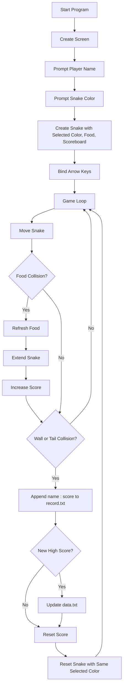

# Snake Game with High Score Tracking

A classic Snake game built with Python `turtle`.  
The game prompts for player name and snake color at startup, stores the highest score in `data.txt`, and appends per-round score history entries (`name : points`) to `record.txt`.

## Features

- Real-time snake movement using arrow keys
- Player name input before gameplay starts
- Snake color selection before gameplay starts
- Food spawning at random coordinates
- Collision detection for:
  - walls
  - snake tail
- Automatic snake reset after collision (instead of closing game)
- Persistent high score saved across runs
- Score history logging with player name and points after each game-over round

## Technical Details

- **Language:** Python
- **Graphics Library:** `turtle` (standard library)
- **Core Modules:**
  - `main.py` -> startup player-name/color prompts, game loop, event binding, collision checks
  - `snake.py` -> snake body creation, movement, direction control, reset, selected color rendering
  - `food.py` -> food object and random repositioning
  - `scoreboard.py` -> score rendering, high-score persistence, per-round record logging (`name : score`)
- **Data Files:**
  - `data.txt` -> stores the current high score
  - `record.txt` -> appends each completed round score with player name

## Game Flow Chart



## Python Version

- Recommended: **Python 3.9+**
- Works best with official Python installer from [python.org](https://www.python.org/downloads/) to ensure `tkinter`/`turtle` GUI support.

## How to Run

### 1) Clone the repository

```bash
git clone https://github.com/sunilsuman81/Snake-Game-high-score.git
cd Snake-Game-high-score
```

### 2) Run the game

```bash
python3 main.py
```

If `python3` is not available on your system:

```bash
python main.py
```

## Controls

- `Up Arrow` -> move up
- `Down Arrow` -> move down
- `Left Arrow` -> move left
- `Right Arrow` -> move right

## Player Name Input

- At startup, the game asks for player name in a popup dialog.
- If no name is entered, default value is `Player`.
- That name is used when writing entries to `record.txt`.

## Snake Color Selection

- After entering player name, the game asks for snake color.
- Allowed colors: `yellow`, `green`, `blue`, `red`, `white`, `purple`, `orange`, `pink`, `cyan`.
- If input is empty or not in the allowed list, default color is `yellow`.
- The selected color is applied to all snake segments, including after reset.

## Scoring and Persistence

- Current score increases when snake eats food.
- On collision with wall or tail:
  - current round score is appended to `record.txt` as `player_name : score` (for score > 0)
  - game score resets to `0`
  - if current score is greater than saved high score:
    - `data.txt` is updated with new high score

## Notes

- Keep `data.txt` in numeric format so high score can be parsed correctly.
- The game window closes when you click it after loop exits (`exitonclick()`), though normal gameplay is continuous with reset behavior.
